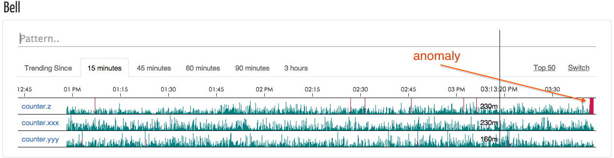

Bell.js
=======

Introduction
------------

Bell.js is a real-time anomalies(outliers) detection system for periodic time
series, built to be able to monitor a large quantity of metrics. It collects
metrics form [statsd](https://github.com/etsy/statsd), analyzes them with the
[3-sigma](docs/design-notes.md), once enough anomalies were found in a short 
time it alerts us via sms/email etc.

We [eleme](github.com/eleme) use it to monitor our website/rpc interfaces,
including api called frequency, api response time(time cost per call) and
exceptions count. Our services send these statistics to statsd, statsd
aggregates them every 10 seconds and broadcasts the results to its backends
including bell, bell analyzes current stats with history data, calculates
the trending, and alerts us if the trending behaves anomalous.

Requirements
------------

- nodejs 0.12+ *(generator feature required)*
- beanstalkd (https://github.com/kr/beanstalkd) (we are using version 1.9)
- ssdb (https://github.com/ideawu/ssdb) (we are using version 1.6.8.8)

Installation
------------

1. Install `bell` as a system command:

       $ npm instal bell.js -g

2. Create config file according to [exampleConfig.js](exampleConfig.js).
3. Add module `bell` to statsd's backends in its config.js.

       {, backends: ['bell']}

4. Start ssdb-server:

       $ ssdb-server -f path/to/ssdb.conf

5. Start beanstalkd:

       $ beanstalkd

6. Start bell services:

       $ bell analyzer -c config.js
       $ bell listener -c config.js
       $ bell webapp -c config.js
       $ bell alerter -c config.js
       $ bell cleaner -c config.js
   And I suggest you manage these services with something like supervisord.
