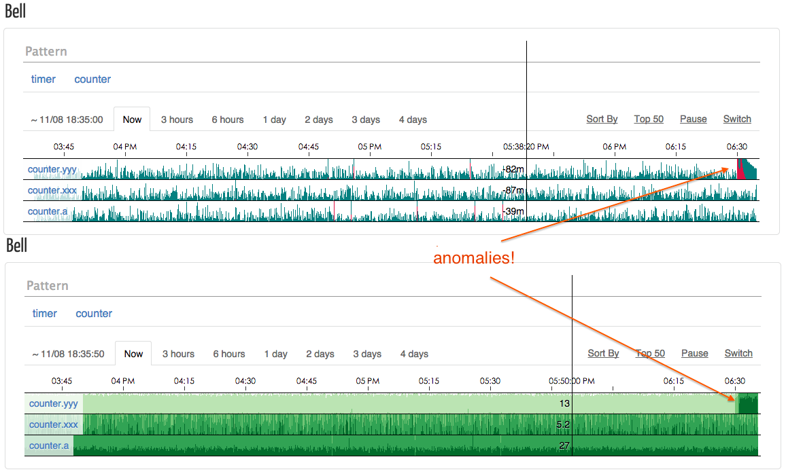

Bell.js
=======



Introduction
------------

Bell.js is a real-time anomalies(outliers) detection system for periodic time
series, built to be able to monitor a large quantity of metrics. It collects
metrics form [statsd](https://github.com/etsy/statsd), analyzes them with the
[3-sigma](docs/design-notes.md), once enough anomalies were found in a short 
time it alerts us via sms/email etc.

Use Case
--------

We [eleme](github.com/eleme) use it to monitor our website/rpc interfaces,
including api called frequency, api response time(time cost per call) and
exceptions count. Our services send these statistics to statsd, statsd
aggregates them every 10 seconds and broadcasts the results to its backends
including bell, bell analyzes current stats with history data, calculates
the trending, and alerts us if the trending behaves anomalous.

For example, we have an api named `get_name`, this api's response time (in ms)
is reported to bell from statsd every 10 seconds:

```
51, 53, 49, 48, 45, 50, 51, 52, 55, 56, .., 300
```

Bell will catch the latest stat `300` and report it as an anomaly.

Why don't we just set a fixed threshold instead (i.e. 200ms)? This may also work 
but we may have a lot of apis to monitor, some are fast (~10ms) and some are slow
(~1000ms), it is hard to set a good threshold for each one, and also hard to set 
an appropriate global threshold for all. Bell sloves this via [3-sigma](doc/design-notes.md),
it gives dynamic thresholds for each metric ("learned" from history data). We 
don't have to set a threshold for each metric, it will find the "thresholds" automatically.

Features
--------

* Automatically anomalies detection.
* Anomalies visualization on the web.
* Alerting rules administration.
* Metrics comes from [statsd](https://github.com/etsy/statsd).

If you think that bell is too complicated, you may check out our
[noise](https://github.com/eleme/noise), which is simpler and faster but only
for anomalies detection.

Requirements
------------

- nodejs 0.12+ *(generator feature required)*
- beanstalkd (https://github.com/kr/beanstalkd) (we are using version 1.9)
- ssdb (https://github.com/ideawu/ssdb) (we are using version 1.6.8.8)

Installation
------------

1. Install `bell` as a system command:

    ```bash
    $ npm instal bell.js -g
    ```

2. Create config file according to [exampleConfig.js](exampleConfig.js).
3. Add module `bell` to statsd's backends in its config.js.

    ```js
    {
    , backends: ['bell.js']
    }
    ```

4. Start ssdb-server:

    ```bash
    $ ssdb-server -f path/to/ssdb.conf
    ```

5. Start beanstalkd:

    ```bash
    $ beanstalkd
    ```

6. Start bell services:

    ```bash
    $ bell analyzer -c config.js
    $ bell listener -c config.js
    $ bell webapp -c config.js
    $ bell alerter -c config.js
    $ bell cleaner -c config.js
    ```
    And I suggest you manage these services with something like supervisord.

Services
--------

Bell has 5 services (or process entries):

1. **listener**

    Receive incoming stats from statsd over tcp, pack to jobs and send them 
    to job queue.

2. **analyzer**

    Fetch jobs from queue, analyze current stats with history data via 
    [3-sigma rule](doc/design-notes.md)
    and send message to alerter once an anomaly was detected.

3. **webapp**

    Visualize analyzation results and provide alerting management.

4. **alerter**

    Alert via email or text message once enough anomalies were detected.

5. **cleaner**

    Clean metrics that has a long time not hitting bell.

Alerter Sender
---------------

A sender is a nodejs module which should export a function `sendEmail` or
`sendSms` (or both), see [exampleSender.js](exampleSender.js) for example.

Implementation Notes
--------------------

- [Anomalies detection algorithm](doc/design-notes.md#anomalies-detection-algorithm)
- [Eliminate periodicity](doc/design-notes.md#eliminate-periodicity)
- [Anomalous Serverity Trending](doc/design-notes.md#anomalous-serverity-trending)

License
-------

MIT Copyright (c) 2014 - 2015 Eleme, Inc.
